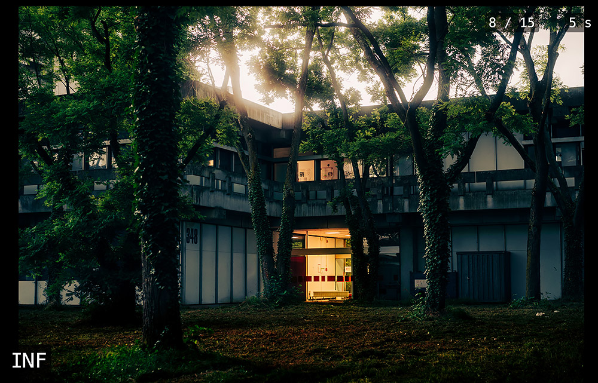

# Pecha Kucha Slideshow
+ allows you to view image galleries [Pecha Kucha](https://en.wikipedia.org/wiki/PechaKucha) style in your browser
+ 20s per image

## Instructions
1. download this repo, e.g. here: https://github.com/jankoegel/pecha-kucha-slideshow/archive/refs/heads/main.zip
2. extract ZIP file and drag `index.html` into your browser
3. drag image files into the page
4. press "Start Slideshow" button

## Controls
+ exit slideshow with `Esc` key
+ move forward/back with `right/left arrow` keys
+ pause with `space` key

## Screenshots
+ Image overview with "Start Slideshow" button:
  
+ slideshow with timer, counter and image label:
  